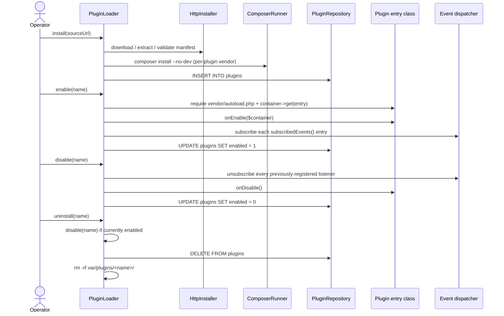

# Phlex plugin developer guide

> **Status:** scaffold. The full developer guide arrives in **A.7**.
> A.4 added the plugin loader; this page now documents the lifecycle
> contract that A.4 puts in place.

## What lives here today (A.4)

- The **plugin manifest specification** —
  [`manifest.md`](manifest.md) and
  [`manifest.schema.json`](manifest.schema.json). PHP value object:
  `Phlex\Plugins\Manifest`.
- The **plugin lifecycle contract** — `Phlex\Plugins\Contract\LifecycleInterface`.
- The **plugin loader** — `Phlex\Plugins\PluginLoader`. Operator
  workflow today is to call `$loader->installFromDirectory($path)` or
  `$loader->install($url)` from a CLI script; the admin UI lands in
  **A.5**.
- The **alias map** between manifest event names and PHP event classes —
  `Phlex\Plugins\EventNameMap`. See the canonical catalog in
  [`../dev/event-reference.md`](../dev/event-reference.md).

## Lifecycle at a glance



## Authoring a `LifecycleInterface` plugin

A plugin entry class is the FQCN that appears in `plugin.json#/entry`.
It MUST implement `Phlex\Plugins\Contract\LifecycleInterface` (note:
this interface is the temporary home until B.1 hoists it to
`Phlex\Shared\Plugin\LifecycleInterface`; once that ships, the
`Phlex\Plugins\Contract` namespace becomes a deprecated alias for one
minor release).

```php
namespace Phlex\Plugins\Lastfm;

use Phlex\Common\Events\Playback\PlaybackStarted;
use Phlex\Common\Events\Playback\PlaybackStopped;
use Phlex\Plugins\Contract\LifecycleInterface;
use Psr\Container\ContainerInterface;
use Psr\Log\LoggerInterface;

final class Plugin implements LifecycleInterface
{
    private ?LoggerInterface $logger = null;
    private ?LastfmClient $client = null;

    public function onEnable(ContainerInterface $container): void
    {
        // Pull whatever services the plugin needs from the host container.
        $this->logger = $container->get(LoggerInterface::class);
        $this->client = new LastfmClient(/* config */);
    }

    public function onDisable(): void
    {
        $this->client = null;
    }

    public function subscribedEvents(): array
    {
        // Keys are event FQCNs; values are method names on $this
        // (or any PHP callable).
        return [
            PlaybackStarted::class => 'onPlaybackStarted',
            PlaybackStopped::class => 'onPlaybackStopped',
        ];
    }

    public function onPlaybackStarted(PlaybackStarted $event): void
    {
        $this->client?->nowPlaying($event->userId, $event->mediaItemId);
    }

    public function onPlaybackStopped(PlaybackStopped $event): void
    {
        if ($event->reachedEnd) {
            $this->client?->scrobble($event->userId, $event->mediaItemId);
        }
    }
}
```

## Per-plugin `composer.json`

Every plugin MUST ship a `composer.json` so the loader can resolve
its dependencies into an isolated `vendor/` tree under
`var/plugins/<name>/vendor/`. Without composer the loader refuses to
install the plugin.

A minimum example:

```json
{
    "name": "phlex/plugin-lastfm",
    "type": "phlex-plugin",
    "license": "MIT",
    "require": {
        "php": ">=8.1"
    },
    "autoload": {
        "psr-4": {
            "Phlex\\Plugins\\Lastfm\\": "src/"
        }
    }
}
```

## Manifest event aliases

Plugin manifests reference events by alias rather than FQCN so the
JSON stays human-readable. The loader translates each alias to its
PHP class at enable time via `Phlex\Plugins\EventNameMap`. The full
table lives in [`../dev/event-reference.md`](../dev/event-reference.md);
add an alias declaration to your manifest like so:

```json
{
    "events": [
        "phlex.playback.started",
        "phlex.playback.stopped"
    ]
}
```

If you subscribe to an alias that the loader doesn't recognise, the
loader throws `Phlex\Plugins\Exception\PluginEnableException`. The
list of supported aliases is fixed by the running server's release.

## Signature & trust

The manifest optionally includes a `signature` field of the shape
`sha256:<64-hex>`. For Phase A the loader supports three outcomes:

- **Valid** — signature is on the configured allowlist.
- **Invalid** — signature is present but not on the allowlist (refuse
  install when `PHLEX_PLUGINS_REQUIRE_SIGNATURE=1`).
- **Unsigned** — no signature; logged as a warning and accepted unless
  `PHLEX_PLUGINS_REQUIRE_SIGNATURE=1`.

The trusted-key allowlist is empty out of the box (operator-supplied).
B.x will wire a real signing-key infrastructure; until then, A.4 lets
operators opt into strict signing via env vars while accepting unsigned
plugins by default.

## Distributing your plugin

A.5 adds the operator-facing install path. Once your plugin is
packaged and ready to ship, operators can install it by URL:

1. Publish `plugin.json`, your `composer.json`, your `src/` tree, and
   any other files under a stable HTTPS URL — for example a tagged
   tarball on GitHub releases that the operator can paste into the
   admin UI.
2. Tell operators to browse to `/admin/plugins`, paste the
   `plugin.json` URL into the install form, and click **Install**. The
   server downloads, validates, and stores the plugin under
   `var/plugins/<your-name>/`.
3. To enable, they flip the toggle in the table; the plugin's
   `onEnable()` runs and its listeners are subscribed immediately.

See [`install-from-url.md`](install-from-url.md) for the end-user
walkthrough and [`trusted-plugin-list.md`](trusted-plugin-list.md) for
how operators decide which signatures to trust.

The curated catalog (operators browsing a list of trusted plugins
without copy-pasting URLs) lives in the hub and ships with **Phase
C**.

## Where to file issues

Open a GitHub issue against
[`detain/phlex`](https://github.com/detain/phlex) with the label
`area:plugins`.
